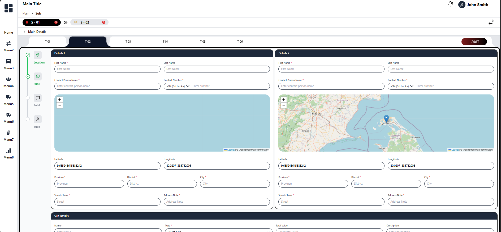
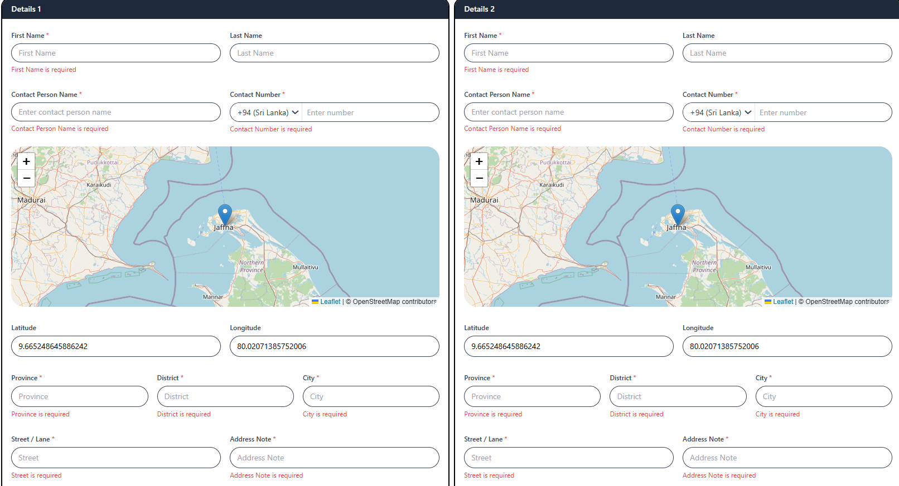
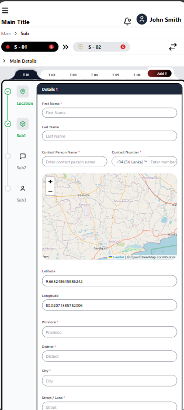
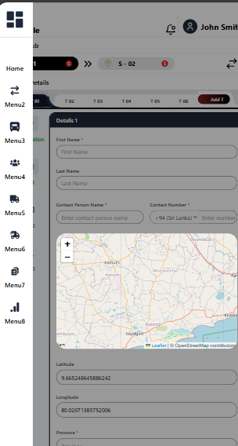

# Organia UI Task

## Project Overview

This is a React-based user interface application built for the Organia task. The application features a dashboard-style layout with tabbed navigation, interactive forms for data entry, and integrated map functionality. It includes components for managing details, forms, and a responsive tab bar for navigation.

The main features include:

- Tabbed interface for organizing different sections
- Interactive forms with validation for data entry
- Integrated Leaflet map with location selection
- Responsive design using Tailwind CSS
- Clean, modern UI with rounded corners and shadows

## Technology Stack

- **Frontend Framework**: React 19.2.0
- **Build Tool**: Vite 7.3.1
- **Styling**: Tailwind CSS 3.4.19
- **Icons**: Lucide React, React Icons, FontAwesome
- **Maps**: React Leaflet 5.0.0 with Leaflet 1.9.4
- **Development Tools**:
  - ESLint for code linting
  - PostCSS and Autoprefixer for CSS processing
  - TypeScript types for React

## Setup and Run Instructions

### Prerequisites

- Node.js (version 16 or higher)
- npm or yarn package manager

### Installation

1. Clone the repository or download the project files
2. Navigate to the project directory:
   ```bash
   cd organia-ui-task-piriyaluxan
   ```
3. Install dependencies:
   ```bash
   npm install
   ```

### Running the Application

1. Start the development server:
   ```bash
   npm run dev
   ```
2. Open your browser and navigate to `http://localhost:5173` (or the port shown in the terminal)

### Building for Production

```bash
npm run build
```

### Preview Production Build

```bash
npm run preview
```

## Screenshots

### Main Dashboard



### Form Validation



### Responsive Design




_Responsive layout on mobile devices_

## Known Limitations and Unimplemented Features

### Tab Bar Responsiveness

- The tab bar responsiveness is not perfectly implemented for all devices
- Some edge cases may occur on very small screens or specific device orientations
- Tab overflow handling could be improved for better UX

### Form Validation

- Basic client-side validation only (no server-side validation)
- Limited input sanitization
- No advanced validation rules (e.g., custom regex patterns beyond basic checks)

### Map Integration

- Map markers are fixed
- No offline map support

## Project Structure

```
src/
├── components/
│   ├── DetailsCard.jsx      # Main form component with map
│   ├── DetailsForm.jsx      # Additional form component
│   ├── Header.jsx           # Application header
│   ├── Sidebar.jsx          # Navigation sidebar
│   ├── StepsSidebar.jsx     # Step indicator sidebar
│   └── TabBar.jsx           # Tab navigation component
├── layouts/
│   ├── MainContent.jsx      # Main layout wrapper
│   └── MainLayout.jsx       # Root layout
├── pages/
│   └── MainDashboard.jsx    # Main dashboard page
└── assets/                  # Static assets
```
